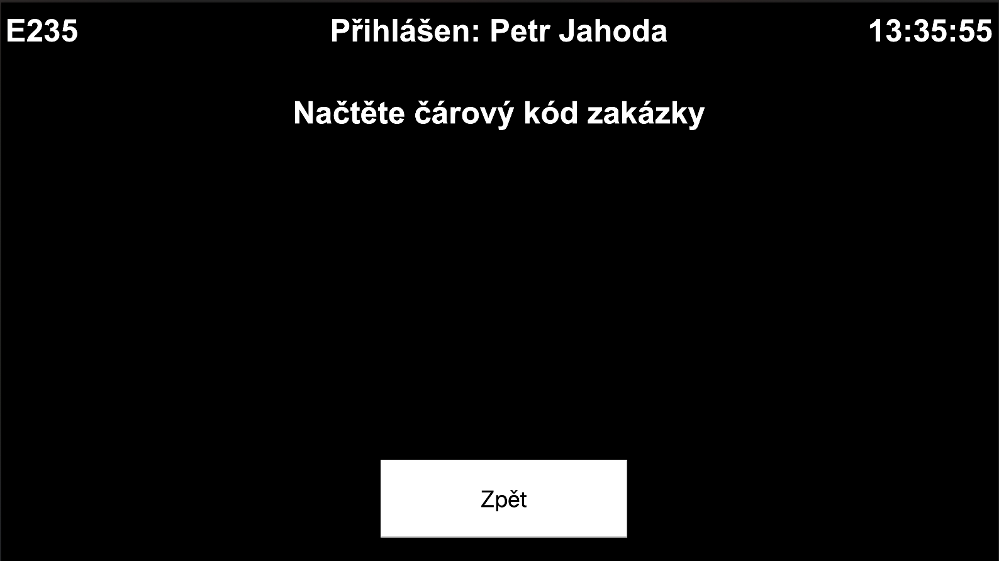
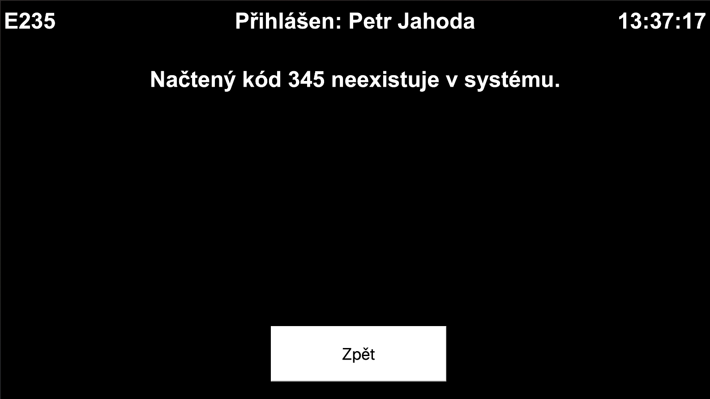
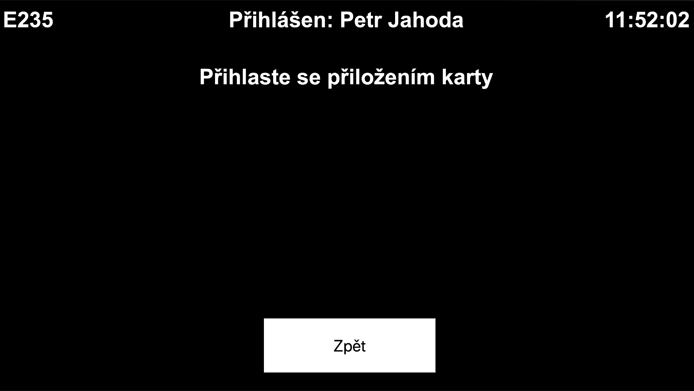
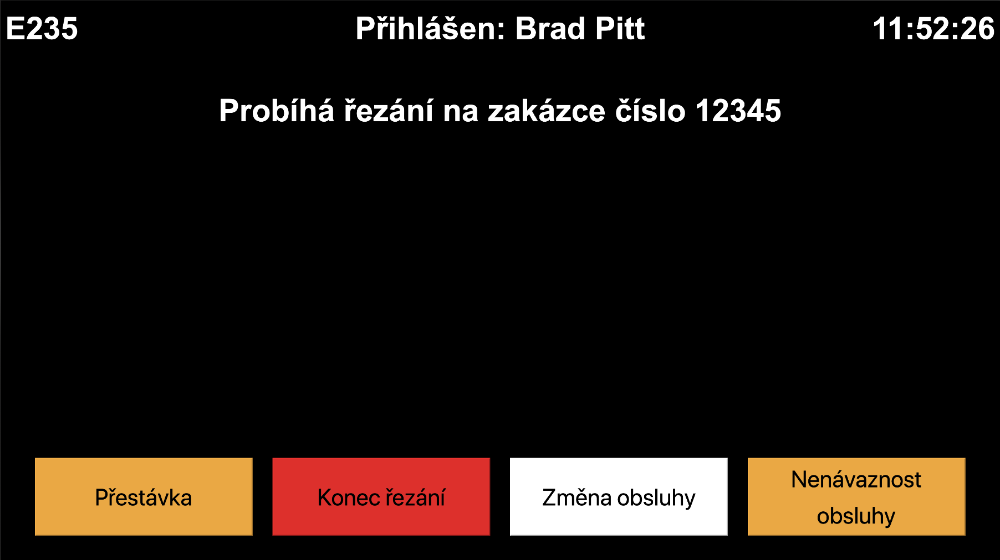
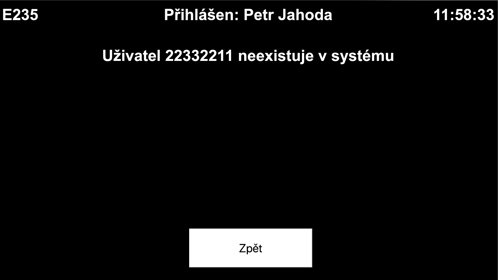
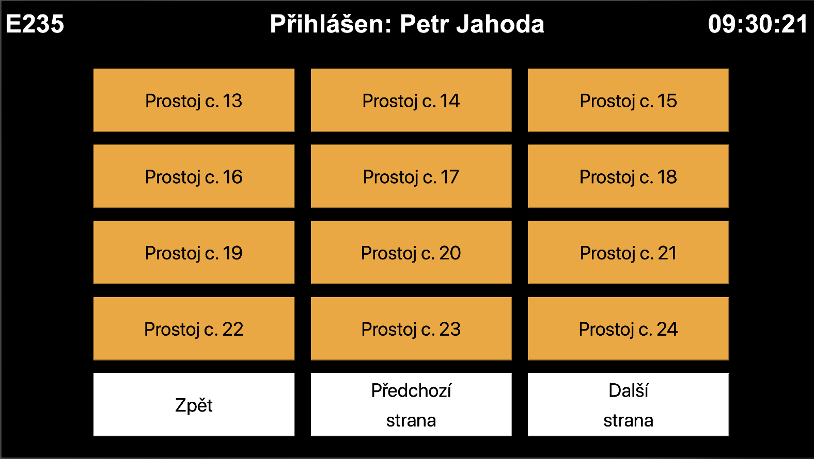
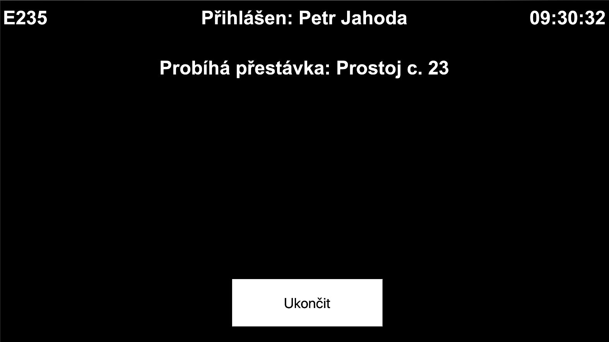
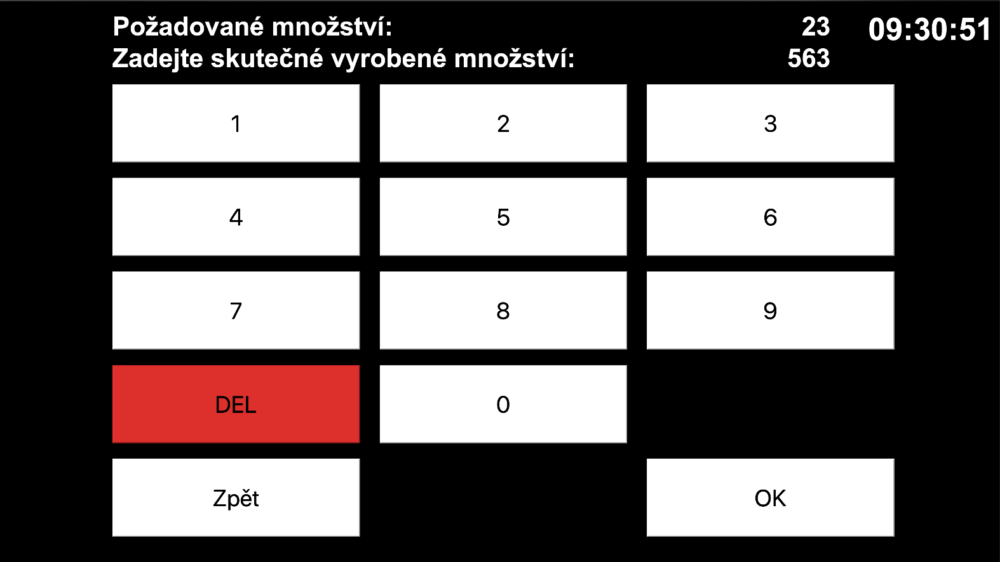

[](https://www.jetbrains.com/go/)
<br/>

[](https://github.com/petrjahoda/sklabel_cutting_webservice/commits/master)
[](https://github.com/petrjahoda/sklabel_cutting_webservice/issues)
<br/>


<br/>
[](https://hub.docker.com/r/petrjahoda/sklabel_cutting_webservice)
[](https://hub.docker.com/r/petrjahoda/sklabel_cutting_webservice/tags)
<br/>
[](https://www.mysql.com) [](https://www.docker.com)

# SK Label Cutting Webservice

## Description
Go web service for SK Label Cutting Workplaces

## Initial screens
1. System first checks request from ip address
    - ip address has assigned deviceId in ```device``` table -> OK
    - ip address does not have assigned deviceId in ```device``` table -> NOK (screenshot)
>
2. System then checks if workplace has any user ```logged in terminal_input_login``` table
    - user is logged -> OK
    - user is not logged -> NOK (screenshot)
>
3. Screen for scanning barcode order is displayed (screenshot)
    - if code exists in K2 -> OK
    - if code does not exists in K2 -> NOK (screenshot)
>
>
> 
4. After successfully scanning the code, main screen is displayed (screenshot) with 4 buttons
    - idle button
    - end order button
    - user change button
    - user break button
    
>
 
## User change button
1. Screen for scanning rfid is displayed (screenshot)
    - if rfid code exists
        - current order is closed
        - K105 is saved to K2
        - new order with new user is created
        - home screen is updated with new user (screenshot)
    - if rfid code does noe exist, user is informed on screen (screenshot)
    - if button for going back is displayed, user gets back to home screen
    
>
>
>
>
>

## User break button
 1. Initial is processed
    - current order is closed
    - K219 is saved to K2
    - 0004 is saved to K2
    - new order with NO user is created
 2. Screen for scanning rfid is displayed (screenshot)
     - if rfid code exists
         - current order is closed
         - new order with new user is created
         - home screen is updated with new user
     - if rfid code does not exist, user is informed on screen
     
 >

## Idle button
1. Screen(s) for choosing idle is selected 
2. After idle is selected
    - K219 is saved to K2
    - idle code is saved to K2
    - idle is created in Zapsi
    - new screen is displayed
3. After end button is selected
    - K119 is saved to K2
    - idle is closed in Zapsi
    - home screen is displayed again 
> 
>
> 

## Cutting end button
1. Screen(s) for adding number of pcs is displayed 
2. After ok button is selected
    - K302 is saved to K2
    - proper amount is saved to K2
    - order is closed in Zapsi
    - original link is opened in format ```http://localhost:81/terminal/www/default/{DeviceId}```
>   
    
© 2020 Petr Jahoda