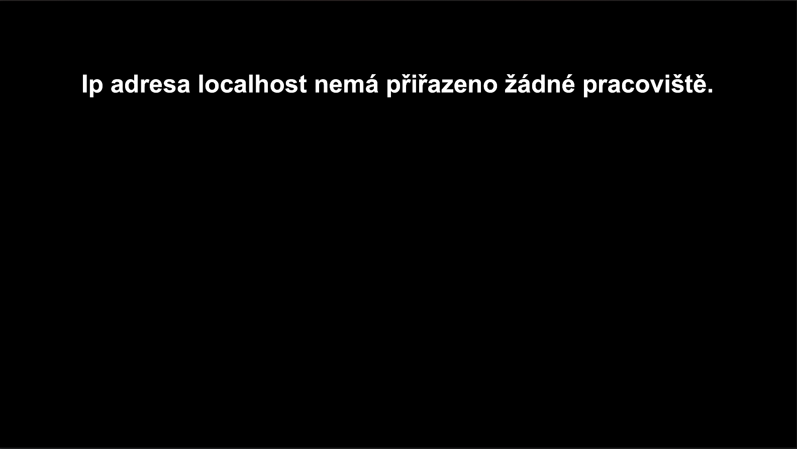

 

 

 

 
 

# SK Label Cutting Webservice

## Description
Go web service for SK Label Cutting Workplaces

## Behavior
1. System first checks request from ip address
    - ip address has assigned deviceId -> OK
    - ip address does not have assigned deviceId -> NOK (screenshot)
>
2. System then checks if workplace has any user logged
    - user is logged -> OK
    - user is not logged -> NOK (screenshot)
>
3. Screen for scanning barcode order is displayed (screenshot)
    - if code exists in K2 -> OK
    - if code does not exists in K2 -> NOK (screenshot)
>
>
> 
4. After successfully scanning the code, main screen is displayed (screenshot)
> 
     
© 2020 Petr Jahoda